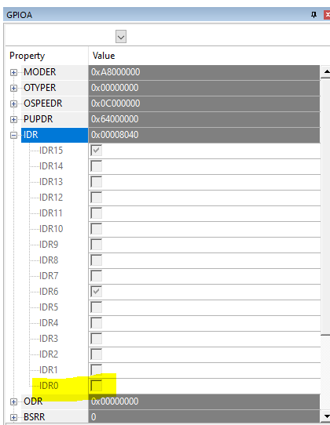

# Making Embedded Systems

This repo contains the blinky exercise from Week 3.

Dev board: STM32F407VG-DISCO 
IDE: Keil uVision

It uses the Ceedling build system to execute tests.

## Questions

<b>1. What hardware registers cause the LED to turn on and off?</b>

The HAL uses `GPIOx->BSRR` to cause the LED to turn on and off in one write action. 

Writing to lower 16 bits sets the I/O line, the lower 16 bits resets.

<b>2. What are the registers you read to find out the state of the button?</b>

Read `GPIOx->IDR` register to find out the state of the button.

<b>3. Can you read the register directly and see the button change in a debugger or by printing out the value of the memory at register's address?</b>

Yes, the *IDR0* register is toggled when button is pushed and un-toggled when released in Keil's "Peripherals -> System Viewer -> GPIO" Window.

